ゆるあつめ — ビーチで集める癒しのコレクションゲーム

ステータス: App Store 審査中（2025/09 現在）

### 公開用設定
- 公開リポジトリでは AdMob等でダミーIDを使用しています。

このページについて: 概要が掴めるように構成しています。

0. TL;DR（30秒で概要）

ジャンル: 直感操作のコレクション × 癒し（2Dピクセル）

操作: タップ＆スワイプのみ。短時間で“ほっと一息”できる体験

コア体験: 砂浜をなぞってアイテムや小さな生き物「シオノコ」を集め、ギャラリーを彩り、自分のギャラリーを組み立てる

世界観: 朝/昼/夕/夜で背景とBGMが遷移。時間帯に応じて出現物やイベントが変化

オンライン要素: フレンドのギャラリー訪問・いいね（Friend Points）

マネタイズ: IAP（泡沫結晶 / リリース感謝パック）、AdMob リワード

技術: SwiftUI / Firebase（Auth, Firestore, Functions v2）/ SwiftData ほか

開発体制: 個人開発（企画 / 設計 / 実装 / アセット制作 / ストア対応まで）

1. アプリリンク / スクリーンショット

App Store：〈リリース後に追記〉

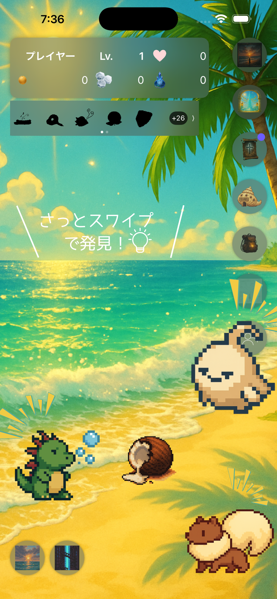	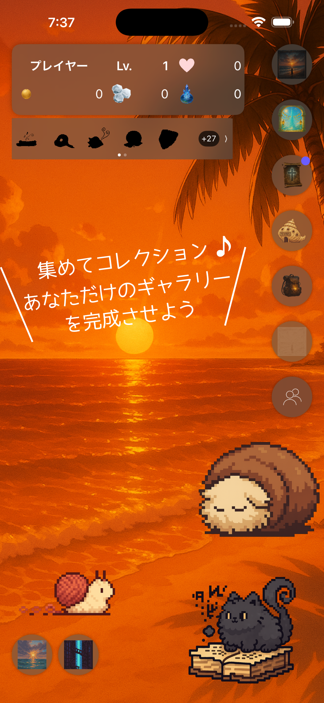	　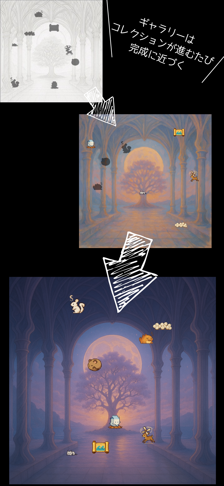	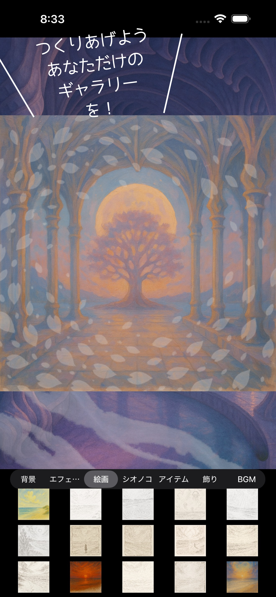		

2. プロジェクト概要

『ゆるあつめ』は、ビーチを指でなぞって見つけて・集めて、あなただけのギャラリーを完成させる癒しのコレクションゲームです。
朝・昼・夕・夜と移ろう時間帯で背景とBGMがシームレスに遷移し、出現物やイベントが変化します。
シンプル操作と短いプレイサイクルを重視し、数分で小さな達成感を積み重ねられる設計にしています。

3. 主なゲーム要素

探索＆収集

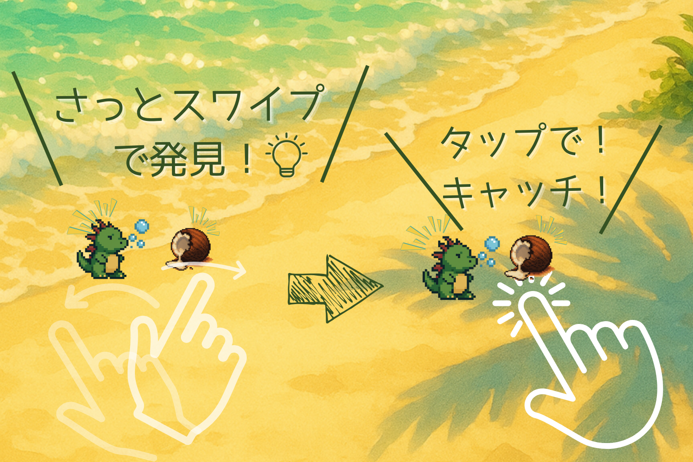

砂浜をスワイプしてアイテム／シオノコを発見・獲得

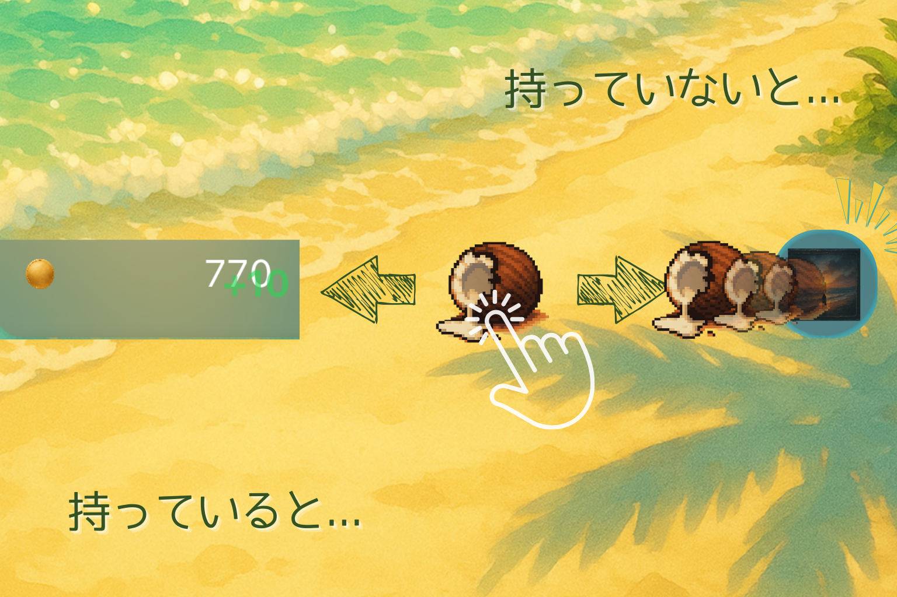

ギャラリー登録 or お金に変換

時間帯システム

朝/昼/夕/夜で出現テーブル・BGM・背景が変わる

数多くのプレイアブルマップと収集対象

    

プレイアブルマップ 55枚超, アイテム: 200超, シオノコ: 260体

ギャラリー

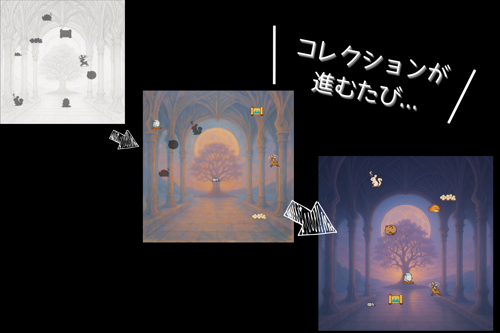

収集物がページに蓄積され、進捗に応じてビジュアルが変化(69枚/ 各5段階)

マイギャラリー

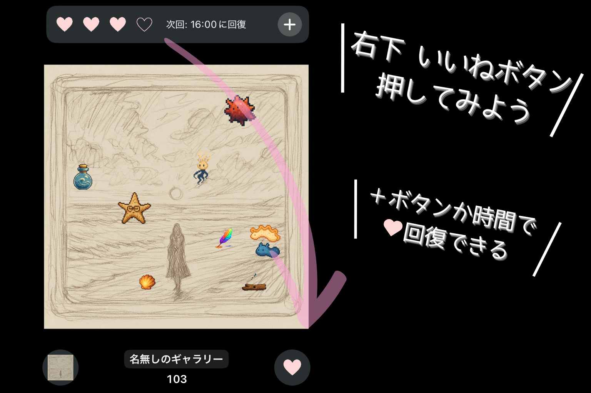

集めたアイテムやシオノコ、背景と絵画、エフェクトやBGMを選択して自分だけのギャラリーを作成できる

マイギャラリー探索

マイギャラリーでもアイテムやシオノコ探しが遊べるため、自分の好きな自分だけの画面で遊べる

フレンド訪問

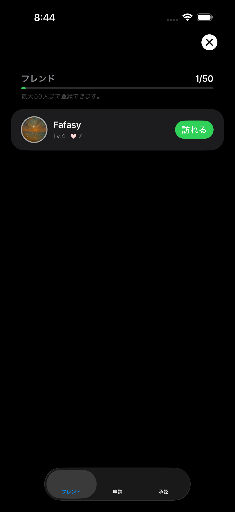  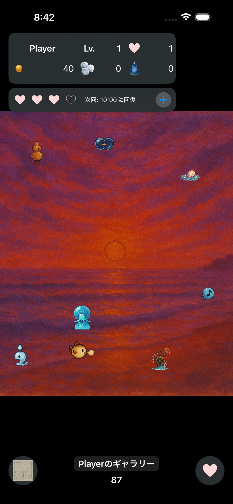  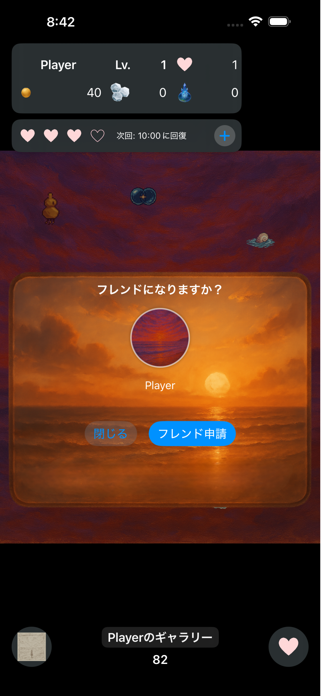  

申請/承認、ギャラリー訪問、いいね（Friend Points）。フレンドのギャラリーに遊びに行ける。フレンドギャラリーではフレンドが設定したアイテムとシオノコ探しが楽しめる。

ガチャ: 単発演出、10連演出、重複時の処理

  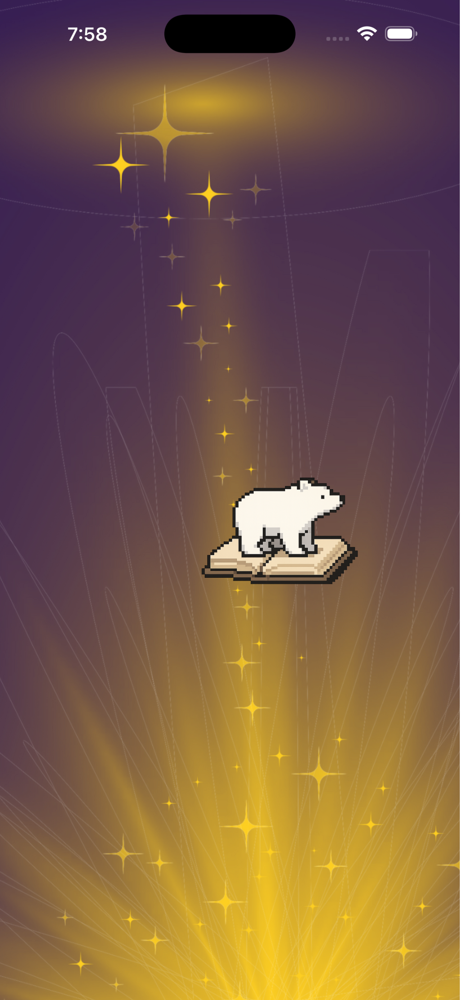  

単発演出、10連演出、重複時の処理

ショップ

  

  

Firebase連携 購入処理、FP制限

ツール

  

探索サポートのツール、アイテム/シオノコ出現確率、レア度強化、時間切替

ヒント, ボーナスアイテム

  

未発見アイテムシルエット表示、シオノコ出現場所表示; ボーナスアイテムの設定、再抽選、ボーナス獲得処理

ミッション: 達成報酬、デイリー/通算、AdMob

スタミナ＆ボーナス: 1日4スロット（4:00 / 10:00 / 16:00 / 22:00 JST）で回復、ボーナスアイテムや広告リロール

マネタイズ: IAP（泡沫結晶 / 一度きりの感謝パック）＋AdMob リワード

4. 技術スタック

アプリ: Swift / SwiftUI, Swift Concurrency（Actors）, SwiftData

バックエンド: Firebase（Auth, Firestore, Functions v2 / Cloud Scheduler）

広告: Google AdMob（Rewarded）

課金: StoreKit 2（定期外 / 消耗型・非消耗型）、レシート検証

その他: SKAdNetwork 設定、ローカライズ（JP中心、英語拡張予定）

5. アーキテクチャ / 設計ハイライト

レイヤリング: Views (SwiftUI) / ViewModels / Services / Repositories

状態管理: @State / @StateObject / @EnvironmentObject + 非同期処理は async/await

サービス例:

StaminaService：Firestore リスナー + Functions 連携 + ローカルキャッシュ

BonusItemManager：レア度・時間帯に応じた選定と広告リロール

FriendService：申請・承認・訪問セッションの整合性管理

Firestore ルールの方針:

isSignedIn, isOwner による所有権チェック

配列・構造体のバリデーション関数（サイズ・型）

一回限定 IAP（感謝パック）をルールで強制（二重購入抑止）

テスト観点:

コアロジック（抽選・回復・一意条件）はPure Function化し、UI と分離して検証

ストア審査用にデバッグフラグを無効化した安全ビルドも用意

6. 私の担当（個人開発）

企画 / 画面設計 / 2D ピクセルアート制作 / BGM ディレクション

クライアント実装（SwiftUI, StoreKit 2, AdMob, SwiftData）

Firebase 設計（コレクション設計 / セキュリティルール / Functions v2）

運用準備（App Store Connect、年齢区分、SKAdNetwork、スクショ作成、ポリシー文書）

7. チャレンジ＆解決

時間帯による出現ロジックを BGM/背景/テーブルに跨って一元管理

IAP の一回限定購入を Firestore ルール＋Functions で二重防止

ガチャの演出と結果描画の非同期競合を解消（UI スレッドと結果配信の順序制御）

AdMob：テスト／本番アドユニットの安全な切替、SKAdNetwork 設定の欠落を解消

・「企画〜UI/UX〜リリース準備まで広く取り組んだto-doリスト」

- [x] Gallery着せ替え機能の実装
- [x] -(collectionViewをマップごとに分類して分けて)-
- [x] ShopMapGalleryの追加。0%の絵も購入したら追加されるように
- [x] 獲得Windowをマップごとに選択する
- [x] Monsterタッチの白くなるのを小さくする
- [x] レア度のズレてるのを治す
- [x] ✨持っていないものを画面上部に表示
- [x] GalleryViewのページ入れ替えに音とアニメーションをつける
- [x] 各NavigationButton先の音楽をつける
- [x] -(Missionをクリアした時、右下にスライドで表示される。)-
- [x] 海へとマップ移動の歩く音をつける
- [x] Item獲得のWindow Window外タップしてもバツと同じ処理
- [x] 横画面にならないようにする。
- [x] 図鑑登録の音とモンスタータップの鳴き声
- [x] 背景の滑らかな移行
- [x] 振動も増やす(Fishでのアイテムとモンスター出た時、捕まえた時)
- [x] FishAppearにおいてアイテム出現時0.5秒だけタップできず、勢いよく上に飛び出すように変更とBeachScratch同様のタップエフェクト
- [x] モンスタータップ時のオーバーレイをガチャの当たりやモンスター出現時のに変更
- [x] GalleryViewにおいて左右スワイプで次のページが見られるようにして。
- [x] ShopViewやミッションViewにおいて左右スワイプでタブを入れ替えられるようにして。
- [x] ー(各種Viewにおいて、閉じやすい方法を考える。（下スワイプでバツボタン同様閉じられるようにして。))ー
- [x] MyGalleryでいった際、の絵画と、モンスターの処理を考える
- [x] BeachScratchの画像をミッションに追加(MyGallery & BeachScratchの背景で使えるように)
- [x] -(アイテムや達成時の受け取りをもっと楽しく嬉しくしたい！ドレミファソラシド！)-
- [x] 時間ごとの画面を何種類か用意して、ランダムに滑らかに入れ替わるようにして、画面の飽きをなくす。それかちょっとずつ動いた画像に切り替えることでうるさくない動画的な楽しみになるかも！
- [x] Beach昼以外の画面の追加
- [x] タップエフェクトを実装
- [x] 各Mapごとの音楽
- [x] MyGalleryでの音楽設定
- [x] 🌟Firebaseを用いた、フレンドとMyGalleryの共有
- [x] 属性消して可読高める
- [x] MapViewにおいてGacha開くと、アイコンが出てしまうので、遷移方法をShop等そのほかのと合わせて。また、GazhaSelectViewを背景にして
- [x] ShopMap Monster／Itemの追加
- [x] 各MapでMonsterとItemを限定するメソッド
- [x] MyGalleryの絵がGalleryの進捗になるように
- [x] MyGalleryで使えるように絵を保存するメソッドの確立(コンプリートで使えるようになる（ミッションとか？）)
- [x] ItemGetOverViewのDispatchqueをバツ押したら止めるようにしないと、次のが想定外に消えちゃう
- [x] 他の人の島に遊びに行くメソッドの構築(別メモ参照)
- [x] -(泡勝手に割れるんじゃなくて、たっぷで割れるようにする（レア度高いのだけ？）)-
- [x] 重複分でコインの獲得と好きなものとの交換(ミキサー)の追加
- [x] Gallery追加とGallery完成によるBackgroundの追加
- [x] BeachScratch他Mapを増やす
- [x] Galleryの初期から持っている黒一色のGallery絵の実装をするか、未完成のものも登録できるようにして、初心者でもできるようにする。
- [x] GalleryBackgroundEffectの実装
- [x] BackgroundEffectの増量
- [x] -(ツールの使用時間が書いてある部分をタップすると使用効果を切るかの選択肢が出る。)-
- [x] 海へのアイコン作成
- [x] 他のMapへの移行アイコン作成
- [x] GalleryEditViewで変更したのが、MyGalleryを閉じて再度開くとDefaultのセットに戻ってしまうバグの修正
- [x] モンスター４：アイテム4のうち、２個ずつ海と砂浜で分けるなどするのもポジション的でいいかも
- [x] ショップの一度きり系のアイテムの購入ロジック
- [x] 画面上部に自分の名前とランク、泡沫結晶の数を常に表示されるようにしたい。
- [x] アイテム獲得の際にお金を得た時、所持金が増える演出を追加したい。
- [x] GatyaViewでボタンが重ならないように非表示 or GachaViewの表示形式変更
- [x] 名前を6文字まで入れられるようなUI構成

- [x] Monster画像をプロジェクトに多数追加しました。また、それにあたりBeachScratchViewにのみ出現するMonsterはMonster_SandとMonster_Beachに、FishAppearViewにのみ出現するMonsterはMonster_FordとMonster_Seaに入れてあるので、それぞれが対応する方にだけ出る(page獲得後)ように。
- [x] ポップアップウィンドウを作る
- [x] Shopの購入処理
- [x] 図鑑登録のヒュッ
- [x] pr192をベースに193も場合によっては加えて or レア度高いのはもっと派手にしたいで派手にする
- [x] ガチャ演出を追加したい。
- [x] まずは１連から。１連を押したら、
1. 海中をイメージした”GachaBackground”を背景にしたGachaViewに泡がゆっくり１つ浮かび上がる。
2. 光とともに泡が消失
3. すでに獲得しているpageの場合はモンスターのシルエットが浮かび上がるだけの短縮演出（透明→不透明）
4. モンスターが未発見だった場合は、画面全体が白く光り、appear_rare1~4.pngを背景に獲得したMonsterの画像が表示される(画面タップでapparの表示が終わり)。
5. 今回のガチャで獲得したMonster一覧を表示(１連なので１体)。
※レア度(1~4)によって色を変えた泡と光の画像を入れているのでよければ使ってください。泡はbubble_rare1~4.png,光はflash_rare1~4.png(4が最もレア)。
- [x] 10連のガチャ演出 -> 10連のガチャ演出を追加したい。
- [x] 10連のガチャ演出を追加したい。
１0連を押したら、
1. 1連同様海中をイメージした”GachaBackground”を背景にしたGachaViewに泡がゆっくり１0個浮かび上がる。
2. 左上から1こずつ１連同様の処理(今回のガチャで獲得したMonster一覧には10個目までいかず、演出を続ける。)
3. 今回のガチャで獲得したMonster一覧を表示(１0連なので１0体を2列５体ずつに並べて)。
- [x] Monsterのグループ分け
- [x] レア度を追加する(各キャラ)。
- [x] レア度を追加する（1~5に)
- [x] 属性を追加する。
- [x] バトルを実装ー考えたプロンプトを見つけ出す(ステージを100何個に変更するのもあり)。
- [x] Monster_Sandに入っているモンスターは前列
Monster_BeachとMonster_Fordに入っているモンスターは中列
Monster_Seaに入っているモンスターは後列
に配置を可能にする。
- [x] -(（Monsterアイコンを背景つきのやつと名前を該当するようにする。）→広告のサンクス絵をこれにする？)-
- [x] 音を増やす（ガチャ音、バトル音、各種効果音）。
⭐️特に基本のFishAppearとBeachScratch部分
- [x] レア度ごとにpriceの値を変更する(1: 10, 2: 50, 3: 200, 4: 500)
- [x] ガチャのレアリティごとの出現確率を決定
- [x] アイテムを作ったやつにすり替える(Beach)
- [x] アイテムの出現メカニズムを整理する
- [x] 集めたモンスターを鑑賞できるシステム作る
- [x] モンスターの種類を増やす（すでにsoraに生成済みの＆新規生成）
- [x] モンスター名を登録する
- [x] モンスター獲得ミッション（全レア3回ずつ）実装
- [x] BeachScraatchのメッセージ出るところを調整して、〇〇 / 〇〇とアイテム獲得に際して表示されるようにする(レア１は50こ単位、レア２は20こ、レア３は5こ、レア４は一個ずつ)　←　これが達成されると結晶をゲット！(初のアイテムも結晶ゲット)
- [x] ギャラリーへの登録の際、GalleryIconの位置に捕まえたアイテムやモンスターの画像が左から右へスワイプして消えるような入るような演出をつけたい。
- [x] アイテム獲得Windowの画像を用意して、サイズ調整
- [x] ショップに並べる画像を作成(ギャラリー・マップ)
- [x] ショップにギャラリーとマップを追加する(mapを購入するとスイッチが入れ替わり、trueになることで解放される？)。
- [x] 購入ロジックを追加
- [x] galleryのEffectを追加する。
- [x] モンスター獲得Windowを豪華にしたい（レア度に応じた豪華さにする）（写真をうまく使う？）。
- [x] お金で行ける世界とステージを広げられる
- [x] アイテムを増やす
- [x] アイテムサイズを大きくする
- [x] ギャラリー画面に音楽つける
- [x] ショップを実装
- [x] ※-レア度ごとに得られるGoldの1日の回数を設定する(レア度1~3: 20回、レア度4：無制限)。-課金で解除
- [x] ツール実装してから、ショップで買えるようにした方がスムーズ？
- [x] ツール実装の前にモンスターの出現率下げておく？あと、時間か回数決める
- [x] -(持ってるだけで効果発揮する泡具の実装)-
- [x] -（スキン系販売 or スキン含むガチャポン）- Gallery含むガシャポン
- [x] ガチャ画面を水泡祭のものに切り替える
- [x] ガチャ選択画面の背景も導入する
- [x] UIを整える(ボタンの配置方法と名前等の配置をブラッシュアップする)。
- [x] ガチャのブラッシュアップ、10連のを1連に持ってきて、10連は３・４・３の三列で演出する。
- [x] ミッション案：波の音を聞く(ログインする)　次の世界の実装のためにちょっとだけ貢献してあげる(報酬：開発者からのありがとう)→本当にいいんですか？ゲーム内アイテムは貰えませんよ、＞＜　→広告再生し、ありがとうの絵を表示　→ミッション表示を本当にありがとうございます。やさしいあなたの今日1日がいい日でありますように！に変更
- [x] 少ない量で一回ミッション追加して
- [x] ミッションを増やす
- [x] デイリーと通算の実装ミッションまとめて投げかけて実装する。
- [x] ミッションクリアしたものは消えるようにする
- [x] 受け取りボタンの画像を作成し、受け取れない時は〇〇を表示。受け取れる時は〇〇を表示
- [x] ・OtherGalleryMapGameViewの実装
他のプレイヤーがGalleryEditViewでMyGalleryを完成させて保存を押すと、その情報がFirebaseに送られ、他のプレイヤーがFirebaseからこれらデータを読み取って、遊べるようにしたい。つまり、OtherGalleryMapGameViewは他のプレイヤーのMyGalleryを再現したMyGalleryMapGameViewのようなイメージのGameViewです(他の人のMyGalleryデータをこっちで読み込んで再現したMapで遊ぶようなイメージ)。
- [x] ・OtherGalleryMapGameViewの、モンスターとアイテムの出現制限だけが、既存のMyGalleryMapGameViewとは異なる。
⚫︎異なる点
{
・アイテムとモンスターがその人のMyGalleryに設定してある4つと4対のみに限定される(アイテムのレア度排出率は同じ。)
・上記の設定されてあるモンスターはガチャで当てていなくても、ここでは出現する(しかし、当てていないモンスターは獲得数にはカウントされないで別の変数(preCount)にカウントされる)。
}

- [x] ・OtherGalleryMapGameViewの実装
- [x] ・OtherGalleryMapGameViewの、モンスターとアイテムの出現制限
- [x] ーMainViewにVisitEntryへ移るボタンを配置する。
- [x] ーこれはランダムに全国のプレイヤーのGalleryへ移されるのと、フレンド一覧から特定のフレンドを選択してそのフレンドのGalleryへ行く二つの方法を用意したい。
- [x] ーこの訪問は3分間に1個溜まる共通のスタミナを20使用する(MAX: 300)。各フレンド、選択が可能なのは1日1回(4時切り替わり)。にするか、制限時間取っ払う。
- [x] フレンド申請をuidを指定して起こせるようにする
- [x] OtherGalleryMapGameViewの制限時間の上に名前を表示
- [x] フレンド申請フレンドだけでなく申請中や承認中で表示されないように
- [x] ー滞在可能時間は2分間。
- [x] ー他人のギャラリー中、右下の一度だけタップできる"いいね"ボタンをタップすると、自分と相手の+1される。
- [x] BGMを実装
- [x] ー制限時間が終了する or 砂浜へ戻る際にフレンドでない場合は"フレンド申請"ボタンが表示される。
- [x] ※なお、ここでだけモンスター出現メソッドとモンスター3回タップ後の獲得の仕様が異なる.
ーここではガチャで当てていなくてもその人のGalleryに設定しているモンスターが登場する。獲得処理はそのモンスターをガチャで当てていた場合は通常通りの処理だが、当てていなかった場合は通常通りの獲得数のカウントはせず、別の変数(preCount)をカウントする。
- [x] ・ガチャで重複したものが出るとレア度に応じた量の泡沫星を獲得できるようにする(レア度1: 1, 2: 5, 3: 10, 4: 30, 5: 100)。
- [x] xpの獲得を実装？実装確認？する。
- [x] レベルに変換するメソッドを確立する(10XPで1レベル)
- [x] gold crystalのFirestoreとの連携
- [x] ・ショップの新規カテゴリーにモンスターを作成し、そこではGoldでなく泡沫星を消費することで好きなモンスターをガチャで当てた状態にできる。
ーこの泡沫星の交換レートを該当モンスターのpreCountに応じて下げられるようにする。
- [x] ミッションとアイテムの獲得達成状況がリセットされてしまう。
- [x] Shopに背景タブを追加
- [x] Shopで購入できるアイテムにFP制限を導入します
- [x] FP制限のアイテムがあと何FPで買えるようになるかの目で見て分かるような表示
- [x] Shopの並び方を工夫する。買っていないもの→アンロックのもの→購入済みのもの
- [x] 通算ミッションが復活するバグが直っているか確認する
- [x] フレンド申請の取り消し操作を追加する
- [x] 購入ボタンのUIをこだわる
- [x] FP制限のかかっているアイテムの購入ボタンをUI的にわかりやすくする
- [x] friendsPointsと泡沫星をUIで見れるようにする
- [x] プロフィールの欄を２列にして、２列目にレベル、bubbleStar, friendPointsを表記
- [x] friendHubから行ったOtherMapGameViewにおいても、左上の’Back’をなくし、PlayerStatusViewが表示されるようにする。
- [x] -(Other~でもHintStripViewが表示されるようにする。)-
- [x] フレンドの削除を作成
- [x] Shopの背景に音楽付きのものを作成する
- [x] ショップやミッションなどタブ系は全部上から下に移動する
- [x] ログイン系の不具合直す or 削除
- [x] ボーナスアイテムが固定化される不具合の修正
- [x] ボーナスアイテムリロールボタンの設定
- [x] アイテムの効果が画面を離れると消えるのを直す
- [x] フレンドポイントの獲得制限をつける
- [x] フレンドポイントの回復ボタンをつける
- [x] フレンドボタンの数のUIを作る
- [x] Gold得られるのスタミナ的なのを消費したらにするか、Goldの1日の獲得可能数を設定する
- [x] 該当Mapの値段を上げて音楽付きにする
- [x] 音楽の選択UIを16bitのにする
- [x] ローディング中の表示
- [x] Dayの緩やか変化に画像を追加してランダムなものにする。
- [x] バックグラウンドのランダム変化をDay以外のものにも拡張する
- [x] 背景エフェクトとギャラリーエフェクトをレア度順に並び替える
- [x] hintStripViewがスワイプできること(続きがあること)をUI的にわかりやすいようにしたい。
- [x] テキストが連続で表示されると、前のものの表示時間に引っ張られて、2個目以降の表示が短くなってしまう。
- [x] アイテム使用UIの更新
- [x] スタミナが規定時間で回復しないことの改善

広告
- [x] スタミナ回復
- [x] ボーナスアイテム
- [x] デイリーミッション

課金
- [x] bubbleCrystalの購入
- [x] 名前入力画面がチラ見えするのを直す。
- [x] フレンド画面スワイプで隣のタブ行けるようにする。
- [x] 初めてすぐの操作案内を作る
- [x] アプリのアイコン作成！目惹かれるような、二色でまとめるとか良いかも！砂浜or キャラ一体
- [x] SwiftDataのエラーを確認する
- [x] 達成条件の何が足りていないのか表示する
- [x] 広告の受け取るボタンを再生ボタンに。
- [x] オフラインでの対応を作成
- [x] -(わかりやすい図鑑の復活)-
- [x] ぜひミュートを解除して？
- [x] アイコンの作成・確認
- [x] Bonus Itemリロードボタンの位置
- [x] shopMonster/ItemのMission追加
- [x] OtherGameViewで全件取得からランダムに一個選んでいるのから、ランダムに1個取得するメカニズムにする(Seed値を与えるなど)。
- [x] デバイスサイズに対応させる
- [x] フレンド申請等の上限数
- [x] 値段5倍
- [x] DocumentID var id: String? = "uid" を直す
- [x] goldの獲得ごとの書き込みを直す.
- [x] レア度４だけのアイテムで島訪問のテスト
- [x] バックグラウンドエフェクト、ギャラリーエフェクトに透明なものを追加して、未所持対応はそれに切り替える。
- [x] bubble Crystalとgoldのセット課金
- [x] 一回きりのボーナス課金＿リリース記念パック
- [x] 17pro maxでガチャResult画面レイアウト崩れ。
- [x] resaltView?のレイアウト崩れ(3列でもいい。)
- [x] ガチャ確率の表記と出現モンスターの表記
- [x] ボーナスミッションのゴールド2倍処理が行われるとき、popUpWindowで当てたことがわかりやすくして、
- [x] ボーナスミッションのゴールド2倍処理が行われるとき、泡沫結晶も１個付与する。

Bonus Item関連
- [x] 重複獲得したボーナスアイテムはHintStripViewから消える。
- [x] ボーナスアイテムのシルエットをタップすると、出現場所や出現時間がわかるようにして。
- [x] 買っているマップの中でしか現れない

- [x] 夕方の背景に貝望
- [x] GalleryEditの各ボタン配置
- [x] MyGallery, GalleryEdit, Otherのギャラリーの大きさを小さくしてバランスよくする。
- [x] エフェクトの値段は下げる。
- [x] MyGalleryのアイテムとモンスちいさすぎる
- [x] 当ててて、出てくる可能性のあるモンスターがまとめられている表。
- [x] アイテムを見つける表
- [x] 結晶のミッションごとの付与量2倍？
- [x] ミッションのギャラリーの名前を無機質なものから変更
- [x] 説明を文字から画像にする
- [x] 回復のプラスボタンの色変える
- [x] 10連ガチャ時に落ちてしまうエラーの対処
- [x] Info.plist に SKAdNetworkItems 一式を追加
- [x] Gach選択画面のレイアウト
- [x] テキストの位置がHintStripとかぶっている(〇〇proだけ？)→直すなら、ItemGetのWindowも一緒に下にする。
- [x] ボーナスアイテム獲得のgold2倍メソッドが呼ばれた時、popUpWindowも表示して、得られたgoldと泡沫結晶の数が分かるようにして。
- [x] 名前タップで名前のView表示するようにして
- [x] Fishの説明短くして他のとこに画像回す
- [x] 獲得テキストと、Windowの場所下げる
- [x] 一回のみのセット商品を追加する松竹梅
- [x] マッチング見直し
- [x] 課金商品の画像を各値段ごとに変更する
- [x] 設定(SF symbols: gear)ボタンを追加
- [x] - 利用規約
- [x] - プライバシーポリシー
- [x] - お問い合わせ
- [x] - BGM/SE オン・オフ
- [x] - 操作ガイドを見る
- [x] - バージョン 1.0.0
- [x] - アカウント削除
- [x] -アカウント連携
- [x] 広告を本番用のidに置き換える。

8. 今後のロードマップ

ガチャ演出のブラッシュアップ

特別な出現条件のシオノコ追加

特別なアイテム獲得Windowの追加

英語・簡体字ローカライズ

9. データ / プライバシー

収集データはゲーム進行に必要な最小限に限定

プライバシーポリシー / 利用規約をアプリ内「設定」から参照可能

アカウント連携（Sign in with Apple）で端末移行に対応（導入段階）

10. ストア状況

App Store: 審査中（リリース後、リンクを本 README に追記します）

11. 作者 / 連絡先

制作者: 磯田　慎之助（個人開発）

Contact: shinnosuke.171717@gmail.com

スクリーンショット一式：/docs/images/
